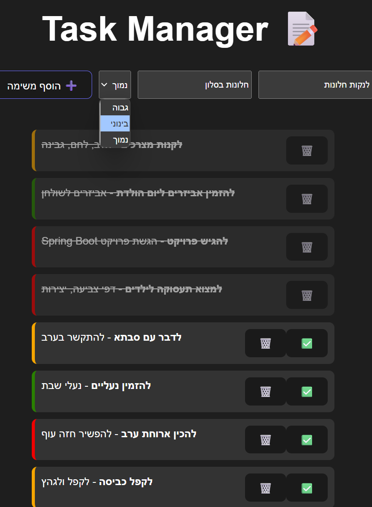
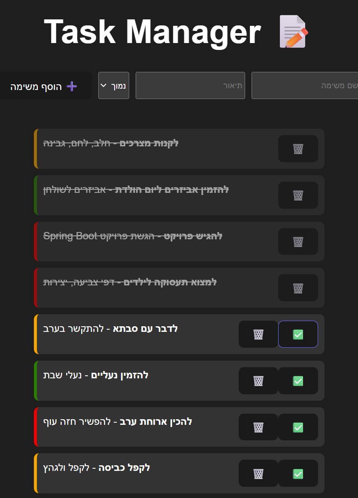
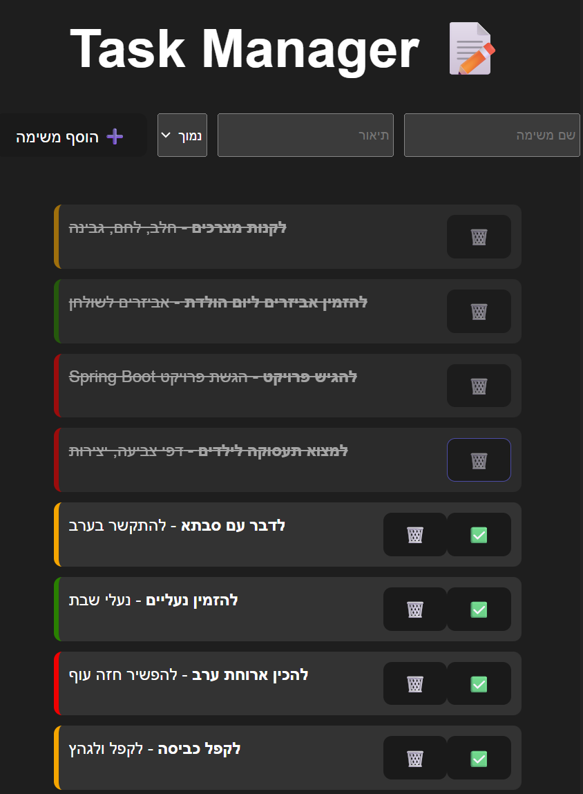

# Task Manager – מערכת לניהול משימות

פרויקט Fullstack פשוט ואלגנטי לניהול משימות יומיומיות – מבוסס Spring Boot (צד שרת) ו-React (צד לקוח). 

---

##  פיצ'רים עיקריים

-  הוספת משימות עם שם, תיאור ורמת חשיבות
-  צפייה בכל המשימות ברשימה מסודרת
-  סימון משימה כהושלמה
-  מחיקת משימה קיימת
-  תצוגה ויזואלית נוחה לפי רמת עדיפות, (אדום- גבוהה, צהוב- בינוני, ירוק- נמוך)
-  תקשורת מלאה בין ה-API ל-Frontend

---

##  טכנולוגיות

**Backend:**
- Java 21
- Spring Boot
- REST API
- אחסון בזיכרון (In-Memory)

**Frontend:**
- React (Vite)
- Axios
- CSS מודרני (כולל תמיכה ב־Dark Mode)

---

##  תמונות מסך
---


  
*הוספת משימה חדשה ובחירת רמת הדחיפות שלה*

  
*סימון משימה כהושלמה*


  
*מחיקת משימה*


---

##  איך מריצים?

###  צד שרת (Spring Boot):

1. ודא ש־Java 21 ומעלה מותקנת.
2. ודא ש־Maven מותקן.
3. פתח יטרמינל בתיקיית `task-manager-server/` (או שם התיקיה שלך) והרץ:

```bash
mvn spring-boot:run
```

> השרת יפעל על `http://localhost:8080`

---

###  צד לקוח (React):

1. ודא ש־Node.js ו־npm מותקנים.
2. פתח טרמינל בתיקיית `task-manager-client/` והריצי:

```bash
npm install
npm run dev
```

> הלקוח יפעל על `http://localhost:5173`

---


##  מבנה תיקיות 

```
TaskManager/
├── task-manager-server/
│   └── (קוד ספרינג בוט)
├── task-manager-client/
│   └── (קוד ריאקט)
├── readme-images/
│   └── (תמונות לread-me)
├── README.md
```

---
